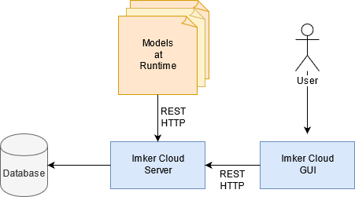

# Architektur

Der erste Schritt bei der Gestaltung der Architektur war die Entscheidung, welche der Komponenten die "Hauptfigur" sein wird. 
Zwischen den "Modellen zur Laufzeit" und dem Server haben wir beschlossen, dass die Modelle bestimmen, was der Server tut. 

Die Anwendung "ImkerCloud" ist in drei Hauptebenen unterteilt:
1.	Models At Runtime
2.	Back-End
3.	Client 
      
In den folgenden Unterkapiteln werden die einzelnen Ebenen ausführlicher beschrieben

## Back-End

Die Backend-Komponente kapselt den Server und eine Datenbank. Die Datenbank speichert Informationen über Bienenstöcke, Benutzer, die die Anwendung verwenden, welcher Benutzer für welchen Bienenstock verantwortlich ist, sowie Benachrichtigungen, die Benutzer möglicherweise erhalten können.
Der Server ist als SpringBoot-Anwendung in der Programmiersprache Java implementiert. Unsere Entscheidung für Java und SpringBoot wurde durch die Tatsache getroffen, dass SpringBoot ein großartiger Bootstrap für kleine bis mittlere Projekte ist, der auch viele Funktionen und Abhängigkeiten enthält, die die Entwicklung der Anwendung schneller und einfacher machen.
Der Server übernimmt erneut seine Rolle als "Gehirn" der Anwendung. Es bietet Methoden zum Bearbeiten von Daten und ermöglicht es Clients, Informationen aus der Datenbank anzufordern. Der Server soll Funktionen für die folgenden Komponenten bereitstellen:

... U-N-D-E-R  C-O-N-S-T-R-U-C-T-I-O-N ...

