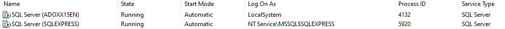
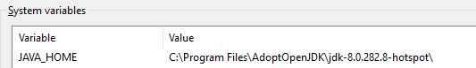
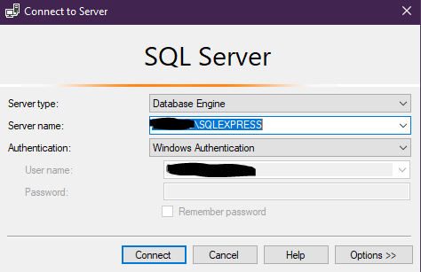
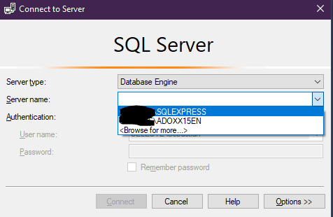
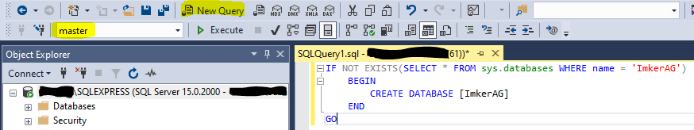
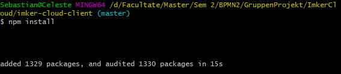

# Installation

## 1. Server

### 1.1 Prerequisites

1. Java 1.8 installed.
2. Maven installed (Atleast version 3).
3. MS SQL Server installed and an active "SQLEXPRESS" instance running on port 1433.

### 1.2 How To Install:

1. Please make sure you have a Java version installed. By running `java -version` you can find out if you have Java and
   which version is installed. We highly recommend you use a 1.8 Java version
   from [here](https://adoptopenjdk.net/?variant=openjdk8&jvmVariant=hotspot)
    1. Make sure OpenJDK8 is checked, with the HotSpot version. Download and install.

2. If you do not already have an SQLEXPRESS instance of MS SQL Server on your machine, please install it
   from [this link](https://www.microsoft.com/en-us/download/details.aspx?id=101064). Following the instructions.
   **NOTE**: Please install the instance with __"Window Authentication"__ !
    1. To check if you have multiple instances installed, please open SQL Server Configuration Manager. Click on **'SQL
       Server Instances'**. As you can see in the picture below, this machine has two instances.
       
    2. The one which has 'Log on As' set to 'NT Service\MSSSQL$SQLEXPRESS' is the **main** instance of MS SQL Server.
    3. Please remember the above fact, as we will need it later.

3. Optionally (but highly recommended), you can download SQL Server Management Studio
   from [here](https://docs.microsoft.com/en-us/sql/ssms/download-sql-server-management-studio-ssms?view=sql-server-ver15)

4. As the service connects to the database through "integrated security", a specific DLL file must be installed.
   [This DLL](https://docs.microsoft.com/en-us/sql/connect/jdbc/download-microsoft-jdbc-driver-for-sql-server?view=sql-server-ver15)
   The same DLL is present in the project in the following folder: "documentation/utils/db".
    1. If you have chosen to download the file, please unzip the .zip archive.
    2. In the directory "sqljdbc_9.2/enu/auth" you will find two directories: "x64" and "x86".
    3. Please check the architecture of the JVM, through a command line by writing the following code:
       `Java -version`
       Example given:
       
       As you can see in the example, this JVM has an x64 architecture. In this case, you should copy the DLL, which is
       located into the "x64" directory. If your JVM has an x32 architecture, use the DLL in the "x86" folder.
        1. **NOTE**: If you receive an error like "java command not found", please make sure that Java is installed on
           your machine and that the following environment variables are present:
            1. `JAVA_HOME` : 
            2. And `Path` has to contain the 'bin' file of your Java
               installation : 
    4. Insert the correct .dll file into the following directories:
        1. `<Java_Installation_Path>/bin`
        2. `<Java_Installation_Path>/lib`
        3. `<Java_Installation_Path>/jre/lib`
        4. `<Java_Installation_Path>/jre/lib`

5. Please check the SQL Server instance. This should run on port 1433 and allow TCP/IP communication.
    1. To check this you can open "SQL Server Communication Manager" application which was installed with MS SQL Server.
       Open the "SQL Server Network Configuration" box in the left window and click on "Protocols for SQLEXPRESS".
       
    2. Double-click on "TCP/IP". If "Enabled" is set to "No", then please change to "Yes".
    3. Now click on "IP Addresses". Scroll all the way down. Under "IPAll" please check that "TCP Port" is set to 1433.
       If not, please change it accordingly.
       

6. (Optional, if changes were made in the previous step) Please restart the machine.

7. Before we start the server, the very first thing we need to do is create the database. If you have installed SSMS
   from step 2, please open it.
    1. You will be greeted with the following window: .
    2. Make sure that 'Server type' is set to "Database Engine". In the 'Server Name' dropdown, please choose your
       SQLEXPRESS instance. .
    3. If your SQLEXPRESS instance does not show up in the dropdown menu, click "Browse for more". Open the "Database
       Engine" menu. Pick your SQLEXPRESS instance. Click 'OK'.
    4. Click 'Connect'.
    5. Press "CTRL + N" on your keyboard. A new Query Page will open up. Copy the SQL Queries below, then execute them.
       Please make sure that the Query is run by the 'master' DB. See the image below as an example.
       
       `DROP DATABASE ImkerAG` -> This might throw an error if you do not have a DB called 'ImkerAG', though that's not
       a problem. This query still has to be run, in case the database exists and contains tables/data the project can
       not access.
       `CREATE DATABASE ImkerAG`

8. Now it's time to download the dependencies for the server and finally start it.
    1. Open a terminal in the 'imker-cloud-server' directory and run the following command:
       `mvn clean install`
       If an error along the lines of "mvn command unknown" shows, please make sure you have mvn installed on your
       machine. You can also use [this guide](https://maven.apache.org/install.html) to install Maven.
    2. After Maven has finished downloading the required dependencies and creating the application's jar file, to start
       the server, you will need to run the following command:
       `mvn spring-boot:run`
    3. The server uses Liquibase to create the required tables and users. The server can be reached at the following
       URL:
       `http://localhost:8080/imker/v1/`
       **Please take note!** A user __is__ added when Liquibase has finished creating the tables. The user's credentials
       are:

       **Username: bpmn  
       Password: bpmn**

9. Done!

## 2. Front-End

### 2.1 Prerequisites

1. NodeJs installed (at least version v14.0.0)

### 2.2 How To Install:

1. Please open a command line in the 'imker-cloud-client' directory.
2. Write the following `npm install` to install npm on your machine and download all the dependencies used by the
   client.
3. The command line will print the following:
   

4. To start the AngularNPM client, please write the following:
   `ng serve`

5. The client can now be opened in the browser with the following URL:
   `http://localhost:4200/login`

## Contact

If any problems should emerge when trying to set up the environment, you can find a list of contacts within the
following directory: 'documentation/utils/contact.txt'