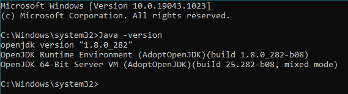
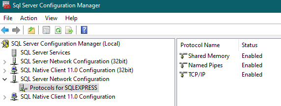
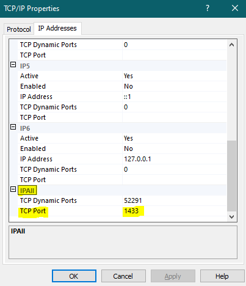

# Installation

## 1. Server

### 1.1 Prerequisites

1. Java 1.8 installed
2. MS SQL Server installed and an active "SQLEXPRESS" instance running on port 1433.

### 1.2 How To Install:

1. As the service connects to the database through "integrated security", a specific DLL file must be must be installed
   must be
   installed. [This DLL](https://docs.microsoft.com/en-us/sql/connect/jdbc/download-microsoft-jdbc-driver-for-sql-server?view=sql-server-ver15)
   The same DLL is present in the project in the following folder: "documentation/utils/db".
    1. Please unzip the .zip archive.
    2. In the directory "sqljdbc_9.2/enu/auth" you will find two directories: "x64" and "x86".
    3. Please check the architecture of the JVM, through a command line by writing the following code:
       `Java -version`
       Example given:
       
       As you can see in the example, this JVM has an x64 architecture. In this case, you should copy the DLL, which is
       located into the "x64" directory. If your JVM has an x32 architecture, use the DLL in the "x86" folder.
    4. Insert the correct .dll file into the following directories:
        1. `<Java_Installation_Path>/bin`
        2. `<Java_Installation_Path>/lib`
        3. `<Java_Installation_Path>/jre/lib`
        4. `<Java_Installation_Path>/jre/lib`

2. Please check the SQL Server instance. This should run on port 1433 and allow TCP/IP communication.
    1. To check this you can open "SQL Server Communication Manager" application which was installed with MS SQL Server.
       Open the "SQL Server Network Configuration" box in the left window and click on "Protocols for SQLEXPRESS".
       
    2. Double-click on "TCP/IP". If "Enabled" is set to "No", then please convert to "Yes".
    3. Now click on "IP Addresses". Scroll all the way down. Under "IPAll" please check that "TCP Port" is set to 1433.
       If not, please change it accordingly.
       

3. (Optional, if changes were made in the previous step) Please restart the machine.

4. Before we start the server, the very first thing we need to do is create the database. Please run the following SQL
   in a new query window (if you are using SSMS):
   `IF NOT EXISTS(SELECT * FROM sys.databases WHERE name = 'ImkerAG') BEGIN CREATE DATABASE [ImkerAG] END GO`

5. Please start the server. The server uses Liquibase to create the required tables and users. The server can be reached
   at the following URL:
   `http://localhost:8080/imker/v1/`
   **Please take note!** A user __is__ added when Liquibase has finished creating the tables. The user's credentials
   are:

   **Username: bpmn  
   Password: bpmn**

7. Done!

## 2. Front-End

### 2.1 Prerequisites

1. NodeJs installed (at least version v14.0.0)

### 2.2 How To Install:

1. Please open a command line in the 'imker-cloud-client' directory.
2. Write the following `npm install`
3. The command line will print the following:
   

4. To start the AngularNPM client, please write the following:
   `ng serve`

5. The client can now be opened in the browser with the following URL:
   `http://localhost:4200/login`